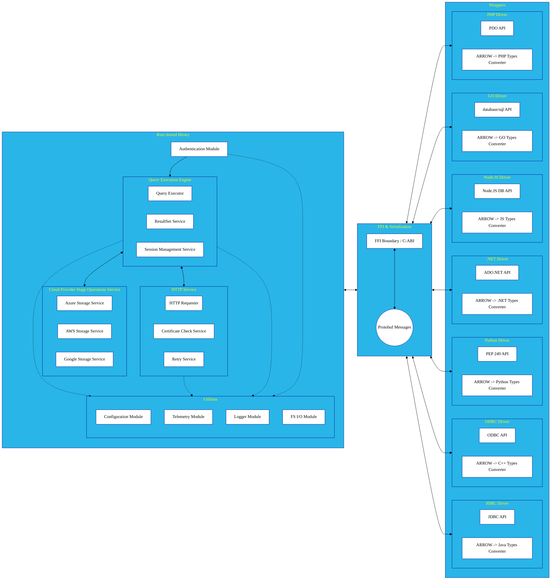
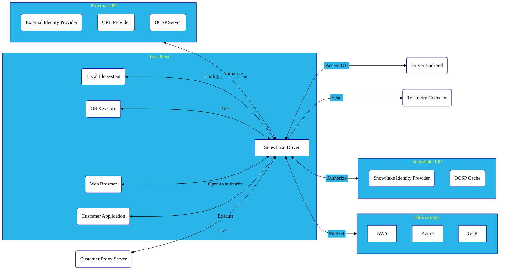

# Architecture

## Components

```mermaid
---
config:
  theme: base
  themeVariables:
    fontFamily: Trebuchet MS
    fontSize: 16px
    fontColor: black
    primaryColor: white
    primaryTextColor: black
    tertiaryTextColor: yellow
    secondaryTextColor: yellow
    secondaryColor: '#29B5E8'
    lineColor: black
    primaryBorderColor: darkblue
    secondaryBorderColor: white
    tertiaryBorderColor: darkblue
    tertiaryColor: '#29B5E8'
---
graph LR
    subgraph RUST [Rust shared library]
        subgraph SQL[Query Execution Engine]
            QUERY[Query Executor]
            RES[ResultSet Service]
            SESSION[Session Management Service]
        end
        AUTH[Authentication Module] 
        subgraph UTILS[Utilities]
            direction TB
            CFG[Configuration Module]
            TM[Telemetry Module]
            LOG[Logger Module]
            IO[FS I/O Module]
        end
        subgraph BLOB [Cloud Provider Stage Operations Service]
            AZ[Azure Storage Service]
            AWS[AWS Storage Service]
            GSP[Google Storage Service]
        end
        subgraph HTTP[HTTP Service]
        direction LR
            HTTPUtil(HTTP Requester)
            CertSvc[Certificate Check Service]
            RetrySvc[Retry Service]
        end
        AUTH-->SQL
        SQL<-->HTTP
        SQL<-->BLOB
        
        SQL-.->UTILS
        HTTP-.->UTILS
        SQL-.->UTILS
        AUTH-.->UTILS
    end

    subgraph IL [FFI & Serialization]
        FFI[FFI Boundary / C-ABI]
        Proto((Protobuf Messages))
        FFI<---->Proto
    end

    subgraph Wrappers
        subgraph JDBC [JDBC Driver]
            direction LR
            API1[JDBC API]
            TC1[ARROW -> Java Types Converter]
        end
        subgraph ODBC [ODBC Driver]
            direction LR
            API2[ODBC API]
            TC2[ARROW -> C++ Types Converter]
        end
        subgraph PY [Python Driver]
            direction LR
            API4[PEP 249 API]
            TC4[ARROW -> Python Types Converter]
        end
        subgraph NET [.NET Driver]
            direction LR
            API3[ADO.NET API]
            TC3[ARROW -> .NET Types Converter]
        end
        subgraph NODE [Node.JS Driver]
            direction LR
            API5[Node.JS DB API]
            TC5[ARROW -> JS Types Converter]
        end
        subgraph GO [GO Driver]
            direction LR
            API6[database/sql API]
            TC6[ARROW -> GO Types Converter]
        end
        subgraph PHP [PHP Driver]
            direction LR
            API7[PDO API]
            TC7[ARROW -> PHP Types Converter]
        end
    end
    
    RUST<-->IL
    
    IL<-->ODBC
    IL<-->JDBC
    IL<-->PY
    IL<-->NET
    IL<-->GO
    IL<-->NODE
    IL<-->PHP
```

## Interfaces  

```mermaid
---
config:
    theme: base
    themeVariables:
        fontFamily: Trebuchet MS
        fontSize: 16px
        fontColor: black
        primaryColor: white
        primaryTextColor: black
        tertiaryTextColor: yellow
        secondaryTextColor: yellow
        secondaryColor: '#29B5E8'
        lineColor: black
        primaryBorderColor: darkblue
        secondaryBorderColor: white
        tertiaryBorderColor: darkblue
        tertiaryColor: '#29B5E8'
---
graph LR
    subgraph Localhost
        Driver[Snowflake Driver]
        FS(Local file system)
        KS(OS Keystore)
        WB(Web Browser)
        App(Customer Application)
    end
    subgraph ExtIDP[External IdP]
        EIdP(External Identity Provider)
        CRL(CRL Provider)
        OCSP(OCSP Server)
    end
    subgraph IntIDP[Snowflake IdP]
        SFIdP(Snowflake Identity Provider)
        OCSPCache(OCSP Cache)
    end 
    Backend(Driver Backend)
    Tel(Telemetry Collector)
    subgraph Blob[Blob storage]
        AWS
        Azure
        GCP
    end
    Proxy(Customer Proxy Server)
    
   ExtIDP<--&nbspAuthorize&nbsp-->Driver
   Driver<--&nbspAuthorize&nbsp-->IntIDP
   Driver<--&nbspAccess DB&nbsp-->Backend
   WB<--Open to authorize-->Driver
   App<--Execute-->Driver
   Driver<--&nbspPut/Get&nbsp-->Blob
   Proxy<--Use-->Driver
   KS<--Use-->Driver
   Driver--&nbspSend&nbsp-->Tel
   FS<--Config, results, cache-->Driver
```